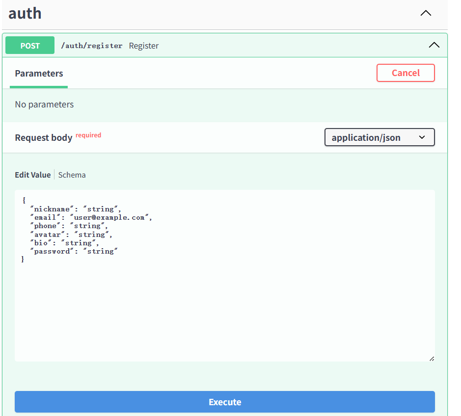
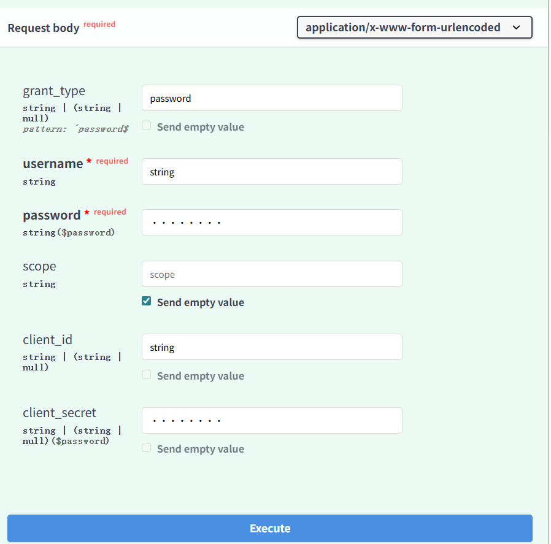
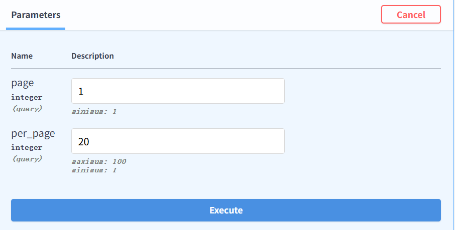
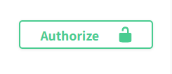
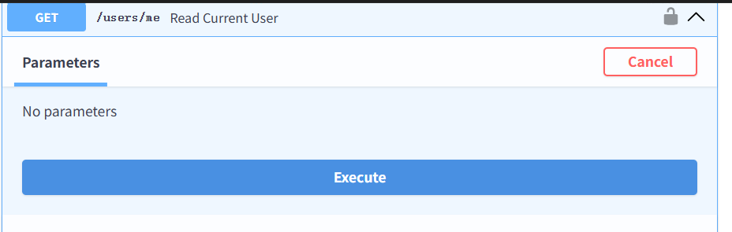
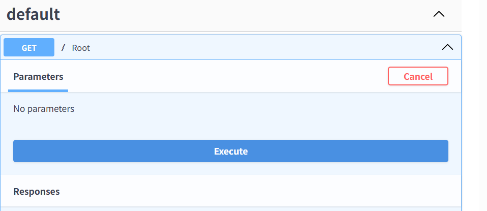

## 环境准备

python -m venv .venv
.venv\Scripts\activate
pip install -r requirements.txt

## 激活环境并启动服务

.venv\Scripts\activate

## 构建镜像

docker-compose build web

## 打开Docker desktop，确保Docker正在运行

docker-compose up -d

## 追踪后端日志

docker-compose logs -f web

## 访问<http://localhost:8080/docs>

## 测试命令

docker-compose up -d db
docker-compose run --rm web pytest -q

## 需要交互

docker-compose run --rm web bash
pytest tests/test_auth.py -q

- 注册
- 
- 登录（使用邮箱）
- 
- 获取所有注册用户（需要管理员权限）
- 
- 登录账号
- 
- 获取已登录用户信息
- 
- 获取管理员信息（需要管理员权限）
- 
