# 股票基金投资论坛 - ER 图

```mermaid
erDiagram
    USER ||--o{ POST : creates
    USER ||--o{ COMMENT : creates
    USER ||--o{ MESSAGE : sends
    USER ||--o{ AUTHENTICATION : has
    USER ||--o{ VIOLATION : receives
    USER ||--o{ RISK_ASSESSMENT : completes
    USER ||--o{ NOTIFICATION : receives
    USER ||--o{ REALTIME_DISCUSSION : creates
    USER ||--o{ ENGAGEMENT : performs
    USER ||--o{ POLL_VOTE : casts
    
    %% 多对多关系通过新实体表示
    USER ||--o{ USER_FOLLOW : initiates
    USER ||--o{ USER_FOLLOW : receives
    USER ||--o{ BOARD_SUBSCRIPTION : has
    USER ||--o{ GROUP_MEMBERSHIP : has
    
    BOARD ||--o{ BOARD_SUBSCRIPTION : has
    GROUP ||--o{ GROUP_MEMBERSHIP : has
    
    BOARD ||--o{ POST : contains
    
    POST ||--o{ COMMENT : has
    POST ||--o{ POLL : has
    POST ||--o{ AUDIT_LOG : undergoes
    POST ||--o{ POST_TAG : has
    POST ||--o{ STOCK_INFO : mentions
    
    COMMENT ||--o{ COMMENT : replies
    COMMENT ||--o{ AUDIT_LOG : undergoes
    
    POLL ||--o{ POLL_OPTION : has
    POLL ||--o{ POLL_VOTE : receives
    POLL_OPTION ||--o{ POLL_VOTE : has
    
    STOCK_INFO ||--o{ REALTIME_DISCUSSION : discussed_in
    
    REALTIME_DISCUSSION ||--o{ AUDIT_LOG : undergoes
    
    TAG ||--o{ POST_TAG : has
    
    MESSAGE }o--|| USER : sentBy
    MESSAGE }o--|| USER : sentTo
    
    POST ||--o{ ENGAGEMENT : receives
    COMMENT ||--o{ ENGAGEMENT : receives
    
    POLL_VOTE }o--|| POLL_OPTION : chooses
    POST ||--o{ ATTACHMENT : contains
    ATTACHMENT }o--|| USER : uploadedBy
    
    %% 新增实体定义
    USER_FOLLOW {
        string followerId PK
        string followingId PK
        datetime createdAt
    }
    
    BOARD_SUBSCRIPTION {
        string userId PK
        string boardId PK
        datetime subscribedAt
    }
    
    GROUP_MEMBERSHIP {
        string userId PK
        string groupId PK
        enum role
        datetime joinedAt
    }
    
    POST_TAG {
        string postId PK
        string tagId PK
    }

    %% 原有实体定义
    USER {
        string userId PK
        string nickname
        string email
        string phone
        string avatar
        string bio
        enum authLevel
        enum status
        int level
        int points
        float influenceValue
        boolean isDeleted
        datetime createdAt
    }

    POST {
        string postId PK
        string userId FK
        string boardId FK
        string title
        string content
        enum postType
        enum status
        enum auditStatus
        int viewCount
        int likeCount
        boolean isEssence
        boolean isDeleted
        datetime createdAt
    }
    
    COMMENT {
        string commentId PK
        string postId FK
        string parentCommentId FK
        string userId FK
        string content
        enum auditStatus
        int likeCount
        boolean isDeleted
        datetime createdAt
    }
    
    BOARD {
        string boardId PK
        string name
        enum category
        int postCount
        int memberCount
        boolean isActive
    }
    
    GROUP {
        string groupId PK
        string ownerId FK
        string name
        enum accessLevel
        int memberCount
        datetime createdAt
    }
    
    MESSAGE {
        string messageId PK
        string senderId FK
        string recipientId FK
        string content
        boolean isRead
        boolean isDeleted
        datetime createdAt
    }
    
    POLL {
        string pollId PK
        string postId FK
        string question
        int totalVotes
        enum status
        boolean allowMultiple
        datetime createdAt
        datetime endTime
    }
    
    POLL_OPTION {
        string optionId PK
        string pollId FK
        string text
        int voteCount
        int displayOrder
    }
    
    TAG {
        string tagId PK
        string name
        enum category
        int usageCount
    }
    
    AUTHENTICATION {
        string authId PK
        string userId FK
        enum type
        enum status
        json credentials
        datetime createdAt
    }
    
    AUDIT_LOG {
        string auditId PK
        string contentId FK
        string userId FK
        enum contentType
        enum status
        int riskScore
        datetime createdAt
    }
    
    VIOLATION {
        string violationId PK
        string userId FK
        enum type
        enum severity
        enum status
        int duration
        datetime createdAt
        datetime endTime
    }
    
    NOTIFICATION {
        string notificationId PK
        string userId FK
        enum type
        string content
        boolean isRead
        datetime createdAt
    }
    
    ENGAGEMENT {
        string engagementId PK
        string userId FK
        string contentId FK
        enum contentType
        enum engagementType
        datetime createdAt
    }
    
    STOCK_INFO {
        string infoId PK
        string symbol
        enum market
        string name
        float currentPrice
        float change
        int discussionCount
        datetime lastUpdated
    }
    
    REALTIME_DISCUSSION {
        string discussionId PK
        string userId FK
        string groupId
        string stockId FK
        string content
        enum sentiment
        int likeCount
        boolean isDeleted
        datetime createdAt
    }
    
    RISK_ASSESSMENT {
        string assessmentId PK
        string userId FK
        int investmentYears
        enum riskTolerance
        enum knowledgeLevel
        int investmentAmount
        int score
        datetime createdAt
    }
    
    POLL_VOTE {
        string voteId PK
        string userId FK
        string optionId FK
        datetime votedAt
    }
    
    ATTACHMENT {
        string attachmentId PK
        string postId FK
        string userId FK
        string filename
        string filePath
        enum fileType
        int fileSize
        enum auditStatus
        boolean isDeleted
        datetime createdAt
    }
```

## ER 图关系说明

### 一对多关系 (||--o{)
| 关系 | 说明 |
|------|------|
| USER → POST | 一个用户发表多个帖子 |
| USER → COMMENT | 一个用户发表多个评论 |
| USER → MESSAGE | 一个用户发送多条私信 |
| USER → AUTHENTICATION | 一个用户有多条认证记录 |
| USER → VIOLATION | 一个用户可能有多条违规记录 |
| USER → RISK_ASSESSMENT | 一个用户有多条风险评估记录 |
| USER → NOTIFICATION | 一个用户接收多条通知 |
| USER → ENGAGEMENT | 一个用户进行多次互动 |
| BOARD → POST | 一个板块包含多个帖子 |
| POST → COMMENT | 一个帖子有多个评论 |
| COMMENT → COMMENT | 评论可以有多个回复（自引用） |
| POST → ATTACHMENT | 一个帖子可以有多个附件 |

### 多对多关系 (通过关联实体表示)
| 关系 | 说明 |
|------|------|
| USER ↔ USER_FOLLOW | 用户之间的关注关系（多对多） |
| USER ↔ BOARD | 用户可订阅多个板块，板块有多个订阅者 |
| USER ↔ GROUP | 用户可加入多个群组，群组有多个成员 |
| POLL_OPTION ↔ POLL_VOTE | 多个用户投票同一个选项 |
| POST ↔ TAG | 一个帖子有多个标签，标签可用于多个帖子 |

### 自引用关系
| 关系 | 说明 |
|------|------|
| COMMENT → COMMENT | 评论的回复（楼中楼） |

## 核心实体属性总览

### USER（用户）- 核心枢纽
- 主要关系：创建内容、发送消息、参与互动、接收通知
- 关键属性：认证等级、状态、等级、积分、软删除标记

### POST（帖子）- 内容中心
- 主要关系：属于板块、包含评论、关联投票、受到审核、获得互动
- 关键属性：审核状态、精华标记、软删除标记、多种类型

### COMMENT（评论）- 互动基础
- 主要关系：属于帖子、来自用户、支持回复、受到审核、获得互动
- 关键属性：审核状态、软删除标记、层级关系

### BOARD（板块）- 组织结构
- 主要关系：包含帖子、有多个订阅者、包含标签
- 关键属性：分类、活跃状态、成员数统计

### GROUP（群组）- 社交功能
- 主要关系：有多个成员、包含讨论
- 关键属性：权限等级、所有者关联

### 审核与管理
- AUDIT_LOG：记录所有内容审核过程
- VIOLATION：记录用户违规信息
- AUTHENTICATION：记录认证历史

### 用户体验
- NOTIFICATION：通知系统
- ENGAGEMENT：统一互动管理
- RISK_ASSESSMENT：风险评估

### 投资特色
- STOCK_INFO：股票基金信息
- REALTIME_DISCUSSION：实时讨论
- POLL：投票调研

### 内容附件
- ATTACHMENT：支持PDF、Excel等分析报告的上传和审核
